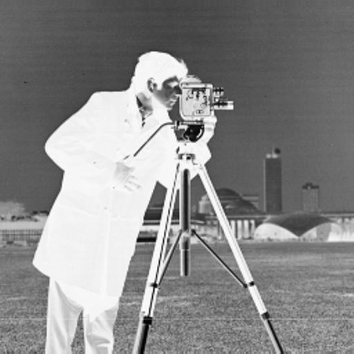
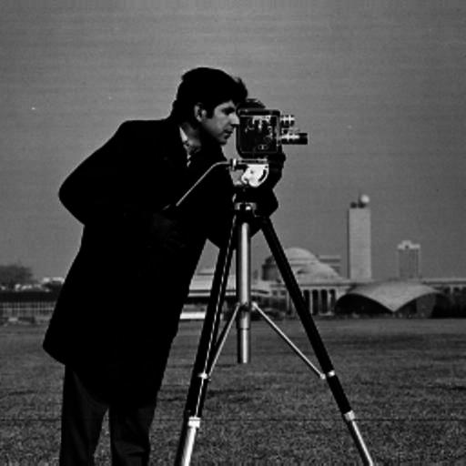
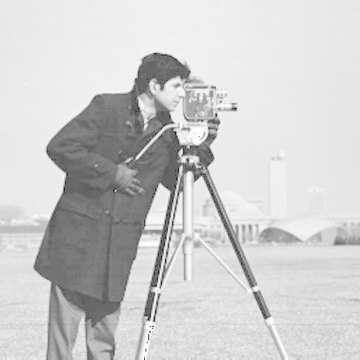
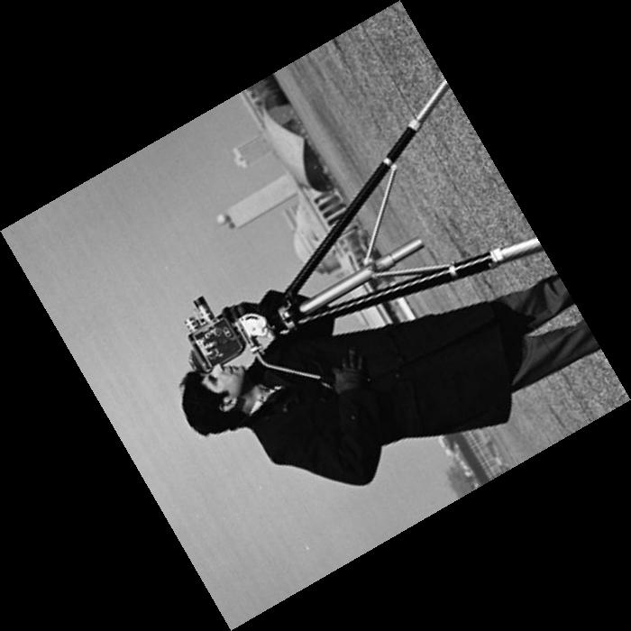
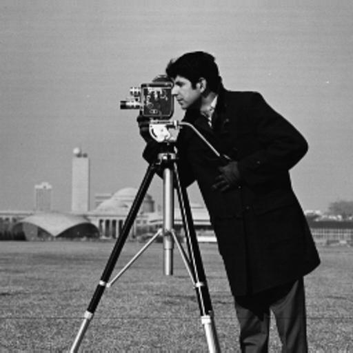
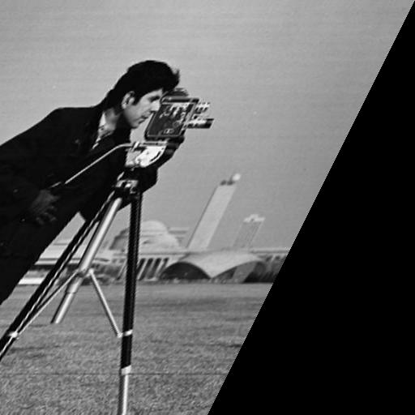

# Image Processing Lab 3 
## Overview
### This repository contains the implementation of Image Processing Lab 3 tasks.
### The tasks focus on applying basic image enhancement techniques using Python.

## Technologies Used
- Python
- PIL (Pillow)
- NumPy

# Tasks Implemented
## Task 1: Image Negative

Applied negative transformation using PIL.

Before:

After: 

## Task 2: Gamma (Power-law) Transformation
After:

## Task 3: Log Transformation
After : 

## Task 4: Image Rotation
After Rotation:

## Task 5: Image Flipping
After Flipping:

## Task 6: Image Shearing
After Shearing:

# Results

The output images demonstrate:

- Intensity transformations (Negative, Gamma, Log)

- Geometric transformations (Rotation, Flipping, Shearing)

# How to Run
## Clone the repository:
git clone https://github.com/aalya3550/03-ImageProcessing-lab3.git
### Navigate to the project folder:
cd 03-ImageProcessing-lab3
### Run the Python script:
python filename.py  

# Author

Aalya Hussian Almusabeh

# Notes
- All tasks were completed successfully.

- Output images are included in the repository.